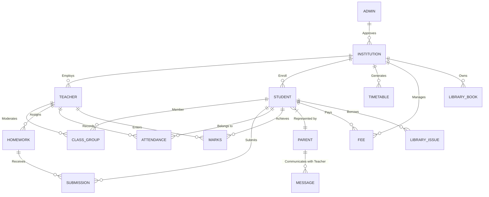

# Software Requirements Specification (SRS) - Together To Refine (TTR)

## 1. Introduction
### 1.1 Purpose
This document provides a comprehensive overview of the **Together To Refine (TTR)** platform. It describes the functional and non-functional requirements, target users, and system architecture.

### 1.2 Scope
TTR is an AI-powered educational management platform designed to cater to a wide range of educational institutions, from rural government schools to elite international schools. It focuses on growth, administrative efficiency, and holistic student development.

---

## 2. Overall Description
### 2.1 User Roles
- **Admin**: System overseer, manages institution approvals and global settings.
- **Institution (Principal/Owner)**: Manages school-wide data, staff, and government compliance.
- **Teacher**: Manages class attendance, marks, homework, and communication with parents.
- **Student**: Accesses learning materials, homework, and tracks own performance.
- **Parent**: Monitors student progress and communicates with teachers.

---

## 3. System Features

### 3.1 Performance Analytics
- Individual growth tracking (no peer ranking).
- Subject mastery and learning velocity metrics.
- AI-driven insights for focus areas.

### 3.2 Attendance System
- Digital attendance tracking by teachers.
- Class-wise and student-wise analytics.
- Automated absentee pattern detection.

### 3.3 Messaging & Collaboration
- WhatsApp-style chat between Parents/Teachers and Parents/Institutions.
- Role-based group creation for classes.
- Real-time notifications for announcements.

### 3.4 Homework & Submissions
- Teacher dashboard for assignment creation.
- Student portal for submitting work.
- Deadline and status tracking (Pending/On-Time/Late).

### 3.5 Administrative Tools
- **Smart Timetable Generator**: AI-assisted room and staff allocation.
- **Exam Seating Planner**: Automated randomized seating charts.
- **Library Management**: Digital issuance and inventory tracking.
- **Government Inspection Readiness**: 50+ checklist for compliance.

---

## 4. Non-Functional Requirements
### 4.1 Security
- Firebase Authentication for secure login.
- Role-Based Access Control (RBAC) via Firestore Security Rules.
- Encryption for sensitive student data.

### 4.2 Performance
- Fast data fetching using Firestore indexes.
- Progressive Web App (PWA) support for offline/low-connectivity access.
- Optimized image handling (Lazy loading).

---

# Entity Relationship (ER) Documentation

## Data Overview
The system uses a hybrid data model. **Firestore** is the primary real-time document store, while **MySQL** is used for structured relational data and reporting.

### Core Entities

| Entity | Description | Key Relationships |
|--------|-------------|-------------------|
| **User** | Central authentication entity | Base for Teacher, Student, Institution |
| **Institution** | Educational organization | Houses many Students and Teachers |
| **Teacher** | Staff member | Manage many Classes, Students, and Homeworks |
| **Student** | Primary learner | Linked to one Institution, multiple Marks/Attendance |
| **Marks** | Assessment records | Linked to Student, Teacher, and Subject |
| **Attendance** | Daily presence records | Linked to Student and Teacher |
| **Homework** | Task assigned by Teacher | Linked to Teacher and Class |
| **Submission** | Student work | Linked to Student and Homework |
| **Group** | Interactive class community | Linked to Teacher and multiple Students |
| **Message** | Communication unit | Linked to Sender and Receiver (or Group) |
| **Timetable** | Class schedule | Linked to Institution, Teacher, and Subject |

### Logical Schema (Mermaid)

